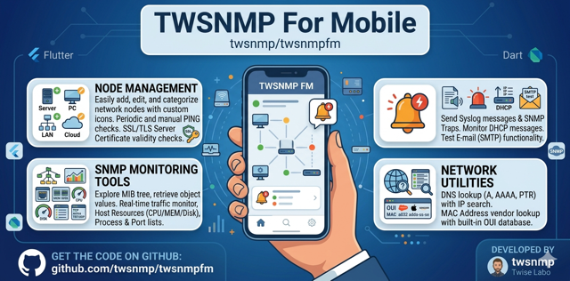
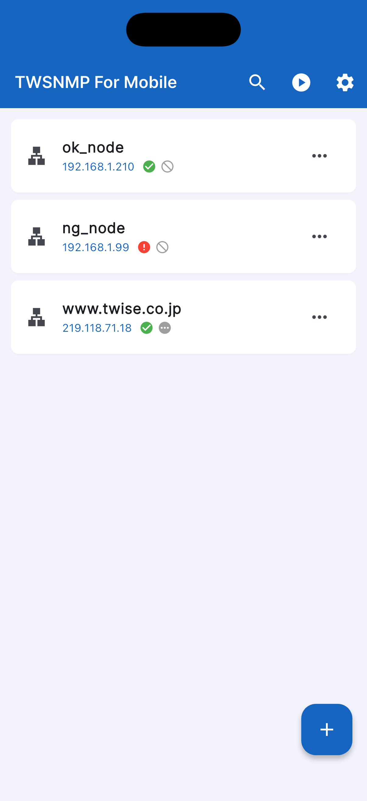
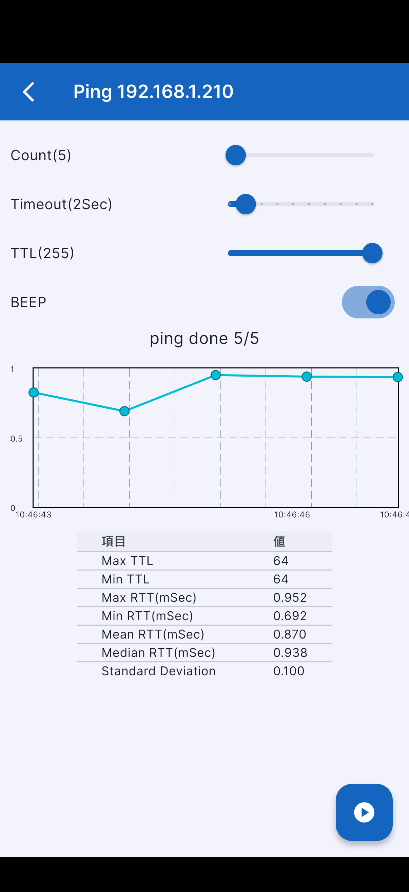
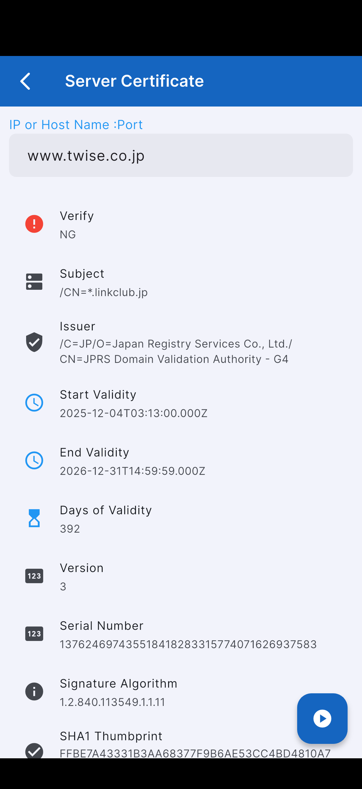
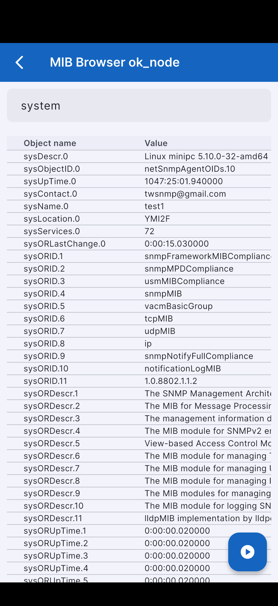
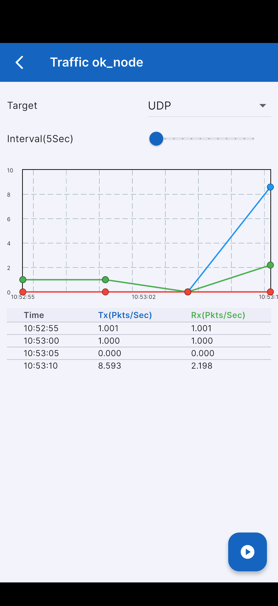
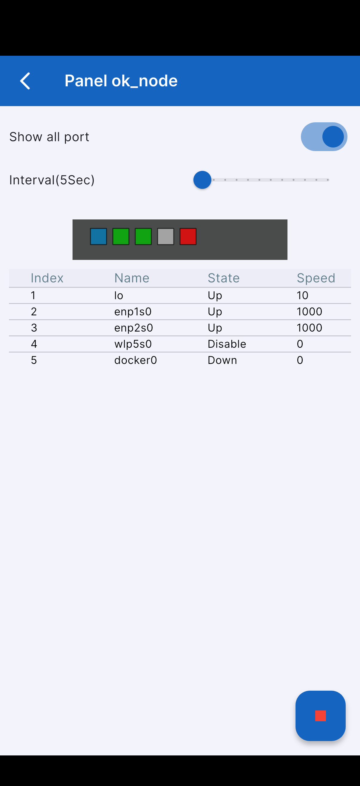
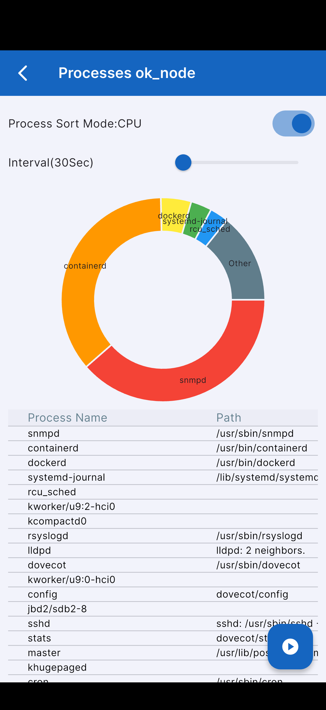

# twsnmpfm

[日本語版 (Japanese)](README_ja.md)



TWSNMP For Mobile - A comprehensive network management tool for your pocket.

## Overview

TWSNMP For Mobile is the mobile version of the classic SNMP manager "TWSNMP". It allows network administrators to monitor and manage their network infrastructure directly from their mobile devices (iOS, Android) and desktops (macOS).

## Features

- **Node Management**: Easily add, edit, and categorize network nodes with custom icons (Server, PC, LAN, Cloud).
  
- **Connectivity Checks**: 
  - Manual PING response confirmation (Single or Batch).
    
  - SSL/TLS Server Certificate expiration and validity checks (HTTPS, etc.).
    
- **SNMP Monitoring Tools**:
  - **MIB Browser**: Explore the MIB tree and retrieve object values using SNMP v1/v2c.
    
  - **Traffic Monitor**: Real-time traffic volume measurement with interactive charts.
    
  - **Virtual Panel**: Visual status display of LAN ports (Up/Down status based on ifIndex).
    
  - **Host Resources**: Monitor CPU, Memory, and Disk usage via Host Resource MIB.
  - **Process List**: View running processes on the target node.
    
  - **Port List**: Check active TCP/UDP port status.
- **Server Testing**:
  - Send Syslog messages and SNMP Traps for testing.
  - Monitor DHCP messages on the network.
  - Test E-mail (SMTP) functionality.
- **Network Search Utilities**:
  - DNS lookup (A, AAAA, PTR, etc.) with IP search.
  - MAC Address vendor lookup with a built-in database (OUI).
- **Modern UI**:
  - Supports Light and Dark modes.
  - Intuitive navigation based on the "TWSNMP Blueprint" design system.
  - Multilingual support (English and Japanese).

## Demo Videos

### PING

<video src="https://github.com/twsnmp/twsnmpfm/raw/refs/heads/main/maestro/demo/record/ping.mp4" width="50%" autoplay loop muted playsinline>
</video>

### Certificate Check

<video src="https://github.com/twsnmp/twsnmpfm/raw/refs/heads/main/maestro/demo/record/check_cert.mp4" width="50%" autoplay loop muted playsinline>
</video>

[Demo Video Folder](./maestro/demo/record/)

## Status
Version 3.0.0 released.

- **iOS**: [App Store](https://apps.apple.com/jp/app/twsnmp-for-mobile/id1630463521)
- **Android**: [GitHub Releases](https://github.com/twsnmp/twsnmpfm/releases)

## How to Build & Test

To build the application from source, ensure you have the [Flutter SDK](https://docs.flutter.dev/get-started/install) installed.

### Using mise (Recommended)

This project uses [mise](https://mise.jdx.dev/) for managing development tools and build tasks.

1. **Install tools**:
   ```bash
   mise install
   ```
2. **Setup environment (First time only)**:
   Installs Android SDK components and CocoaPods.
   ```bash
   mise run setup
   ```
3. **Run tests**:
   ```bash
   flutter test
   ```
4. **Build for specific platforms**:
   - **Android APK**: `mise run build:apk`
   - **iOS IPA**: `mise run build:ios`

### Standard Flutter Commands

1. **Clone the repository**:
   ```bash
   git clone https://github.com/twsnmp/twsnmpfm.git
   cd twsnmpfm
   ```
2. **Install dependencies**:
   ```bash
   flutter pub get
   ```
3. **Run the app**:
   ```bash
   flutter run
   ```

## CI/CD

This repository uses GitHub Actions to automatically build the Android APK.
- **Trigger**: Pushing a tag starting with `v` (e.g., `v3.0.0`).
- **Artifact**: The generated APK is automatically uploaded to the GitHub Release.

## How to Use

1. **Adding Nodes**: Tap the **+** button on the main screen to add a new device. Enter the Name, IP address, and SNMP Community string.
2. **Monitoring Status**: The main list displays icons for PING and Certificate status. A green check indicates OK, while red or amber indicates issues.
3. **Manual Check**: Use the **Play icon** in the top bar to run PING or Certificate checks for all nodes, or tap a node to check individually.
4. **Accessing Tools**: Tap the **three-dot menu** on a node card to access specific tools like the MIB Browser, Traffic Monitor, or Virtual Panel.
5. **Search**: Tap the **Search icon** in the top bar for DNS lookup or MAC address vendor search.
6. **Settings**: Use the **Gear icon** in the top bar to adjust timeouts, theme, and language settings.

## Copyright

See [LICENSE](LICENSE)

```
Copyright 2022-2026 Masayuki Yamai
```
